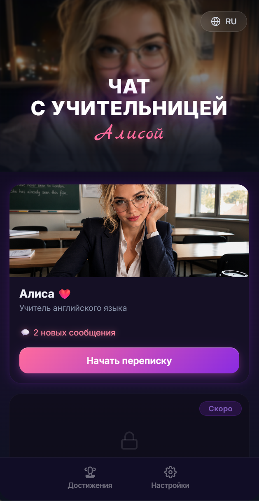
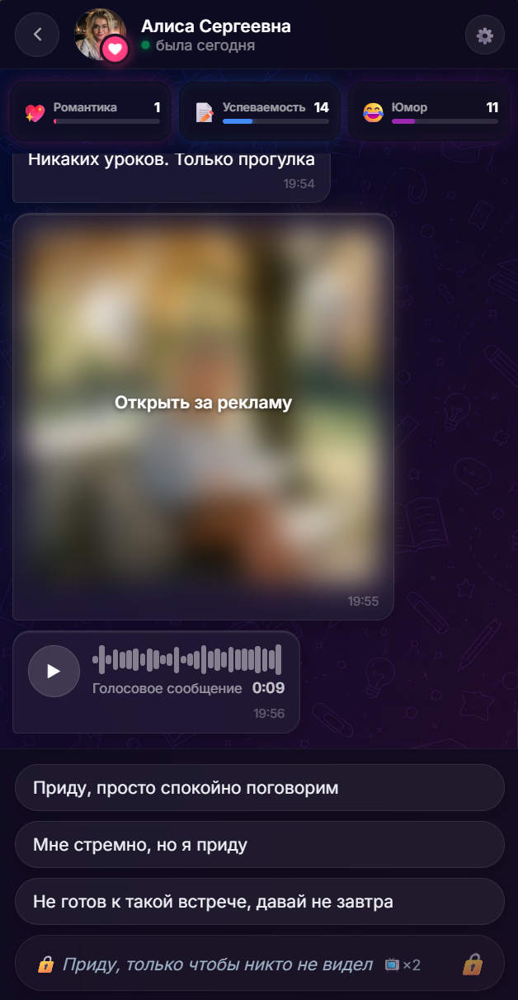
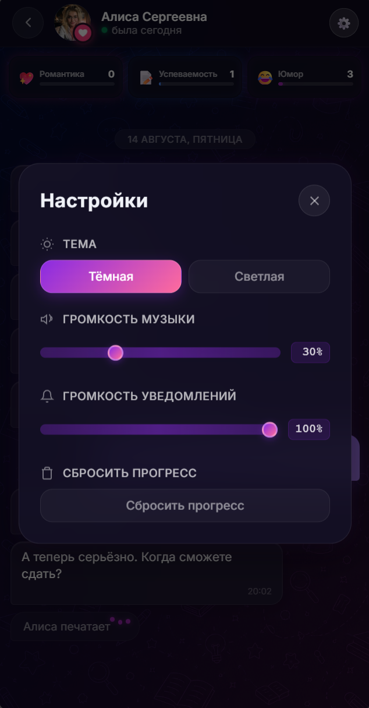
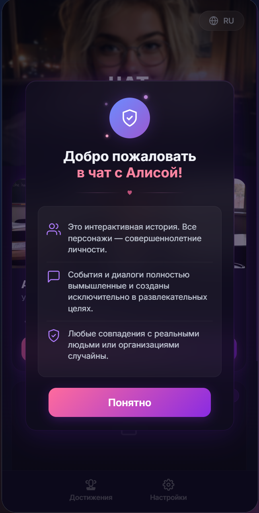

<h1 align="center">👩‍🏫 Чат с учительницей Алисой</h1>

<p align="center">
  <a href="https://fogster-5-999.github.io/chat-with-teacher-alisa/">
    
  </a>
</p>

> ⚠️ **Статус:** Ядро игры готово: полный сюжет на 7 дней, характеристики, автосохранения, медиа-контент и data-driven конструктор дней. Дополнительные фичи (онбординг, SDK, галерея достижений и т.д.) — в процессе.

<p align="center">
  <b>Интерактивная текстовая новелла в формате мессенджера</b><br/>
  Разработана на чистом JavaScript (ES6+ Modules) без сторонних фреймворков и сборщиков.
</p>

<p align="center">
  
  
  
  
  
</p>

---

## Галерея интерфейса

<div align="center">

| **Главное меню** | **Интерфейс чата** |
| :---: | :---: |
|  |  |
| **Настройки и темы** | **Дисклеймер** |
|  |  |

</div>

---

## История разработки

Изначально проект разрабатывался с помощью одного AI-агента. Быстро проявились типичные ограничения: потеря контекста, хрупкая архитектура и баги в критической логике.

Чтобы решить эту проблему, я спроектировал и реализовал мультиагентную систему **[OpenForgeAI](https://github.com/Fogster-5-999/OpenForgeAI)** — надстройку над OpenCode с разделением ролей (архитектор, планировщик, разработчик, QA). Система изначально проектировалась под работу с бесплатными моделями и их ограничениями. Обкатывалась прямо на этой игре.

**Моя роль в обоих проектах:**
- Автор концепции игры, сюжета и механик
- Архитектура игрового движка (data-driven DSL, пошаговый Runner, система сохранений)
- Идея, проектирование и разработка мультиагентной системы OpenForgeAI
- Постановка задач агентам, доработки и ответственность за финальный результат

---

## Сюжет и игровые механики

Вы играете за студента, запустившего английский язык. Вечером вам пишет молодая преподавательница — Алиса Сергеевна.

* **3 динамических характеристики:**
  * **Романтика** — влияет на личные темы и развитие отношений
  * **Успеваемость** — отражает успехи в учёбе и правильность ответов
  * **Юмор** — разряжает обстановку и открывает нетривиальные реплики
* **Сюжетная арка на 7 дней:**
  * **День 1:** Проверка ДЗ и выбор тона общения
  * **День 2:** Интерактивный мини-тест по грамматике и разблокировка фото
  * **День 3–4:** Встреча в кафе и переход на более личные темы
  * **День 5:** Скандал с фото в школьном чате и выбор стратегической линии (дружба / секретные отношения / пауза)
  * **День 6–7:** Встреча в парке, подведение итогов и финал
* **Достижения:** 8 ачивок («Первый шаг», «Знаток грамматики», «Отличник», «Сердцеед», «Шутник», «Коллекционер», «Правдолюб», «Выпускник»)
* **Медиа-контент:** Просмотр фото в полноэкранном режиме (Lightbox) и голосовые сообщения

---

## Технические подробности

* **Чистый стек:** Vanilla JS (ES Modules), HTML5, CSS3. Без React, Vue, Webpack или Vite.
* **Модульный движок:** Пошаговая архитектура (`GameEngine`, `DayRunner`, `StepRunner`, `ConditionEngine`, `Store`).
* **Data-driven DSL:** Весь сюжет описан декларативно в `src/data/story/` без кастомного JS внутри сценария.
* **Автосохранения:** Прогресс сохраняется в `localStorage` с дебаунсингом. При перезагрузке восстанавливается точное состояние диалога и статистика.
* **Локализация и темы:** Интерфейс RU / EN + тёмная / светлая тема.
* **Готовность к SDK:** Интерфейс интеграции с Яндекс Играми, VK Mini Apps и Telegram WebApps (`src/engine/sdk.js`).

---

## Roadmap

**Ближайшие приоритеты (Frontend / Game Engine):**
* Полная английская локализация.
* Галерея достижений + кастомные уведомления.
* Интеграция Yandex Games SDK (реклама + аналитика).
* Документация игрового DSL и публичный API движка.
* Виджет прогресса (открытые/закрытые концовки).

**Бэкенд-составляющая (Python / FastAPI):**
* **Серверная аналитика прохождения:** воронка по дням, статистика выборов игроков, точки дропа (отвала пользователей).
* **API глобального лидерборда:** сохранение результатов прохождения, подсчет очков и формирование рейтинга игроков.

---

## Что можно взять из проекта

* Готовый data-driven движок текстовых новелл / мессенджер-игр
* Рабочую систему условий, эффектов и автосохранений
* Каркас под Яндекс / VK / Telegram WebApps

---

## Структура проекта

```text
chat-with-teacher-alisa/
├── assets/
│   └── screenshots/     # Скриншоты интерфейса
├── res/                 # Графические и аудио-ресурсы (аватары, фон, голосовые)
├── src/
│   ├── app/             # Инициализация, темы, локализация
│   ├── data/            # Конфигурации и DSL-сценарии по дням (day1..day7)
│   ├── engine/          # Движок игры (GameEngine, StepRunner, Audio, SDK)
│   ├── events/          # Шина событий (EventBus)
│   ├── state/           # Управление состоянием и сохранением (Store, ConditionEngine)
│   └── ui/              # Компоненты UI, модалки, стили
├── index.html           # Точка входа
└── README.md
```

---

## Запуск проекта

> **Важно:** проект использует ES Modules. Открывать только через локальный HTTP-сервер (`file://` не сработает).

1. **Клонируйте репозиторий:**
   ```bash
   git clone https://github.com/Fogster-5-999/teach-game-ai-project-.git
   cd teach-game-ai-project-
   ```

2. **Запустите локальный сервер (любым удобным способом):**
   - **VS Code:** Расширение *Live Server* (нажмите `Go Live` на `index.html`).
   - **Node.js (`npx`):**
     ```bash
     npx serve .
     ```
   - **Python:**
     ```bash
     python -m http.server 8080
     ```

3. Откройте адрес `http://localhost:8080` (или указанный сервером порт) в браузере.


